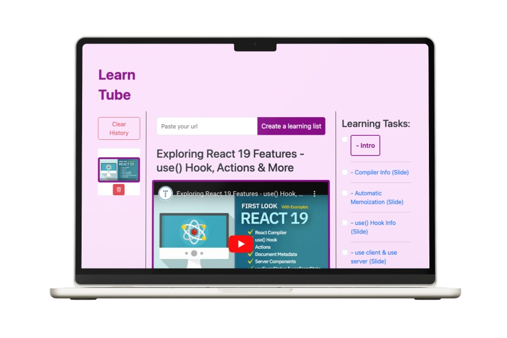

# LEARN TUBE

**[Go to my app in live](https://jgp84.github.io/LT-2024/)**

**Permite crear listas de vídeo de aprendizaje mediante el uso de una URL de un vídeo de Youtube.**

# Checklist de Requerimientos

- [x] Utilizar la última versión LTS de Angular, Typescript y de cualquier librería que se use en el proyecto.

## Componente
- [x] Crear un componente que utilice el servicio anterior.
- [x] El componente debe mostrar una lista paginada de destinos con botones de añadir, editar y borrar.
- [x] El componente debe mostrar un input para filtrar por el destino seleccionado.
- [x] El componente debe generar un formulario vacío al pulsar el botón de añadir.
- [x] El componente debe generar un formulario con los datos del destino seleccionado al pulsar el botón de edición.
- [x] El componente debe preguntar si se está seguro que se desea borrar el destino y, al confirmarlo, lo borrarlo.
- [x] (Opcional) Test unitario del componente.

## EXTRAS (no demandado en los requerimientos)
  - Local storage, para guardar y recuperar los datos de los formularios en caso de recarga del navegador.
  - Pipe personalizado, para truncar el número de caracteres que mostrará la tarjeta en la descripción.
  - Responsive mobile.
  - Animaciones, para estilizar las tarjetas y botones.
  - Deploy de la aplicación en Github Pages.

***

# React + Vite

This template provides a minimal setup to get React working in Vite with HMR and some ESLint rules.

Currently, two official plugins are available:

- [@vitejs/plugin-react](https://github.com/vitejs/vite-plugin-react/blob/main/packages/plugin-react/README.md) uses [Babel](https://babeljs.io/) for Fast Refresh
- [@vitejs/plugin-react-swc](https://github.com/vitejs/vite-plugin-react-swc) uses [SWC](https://swc.rs/) for Fast Refresh
